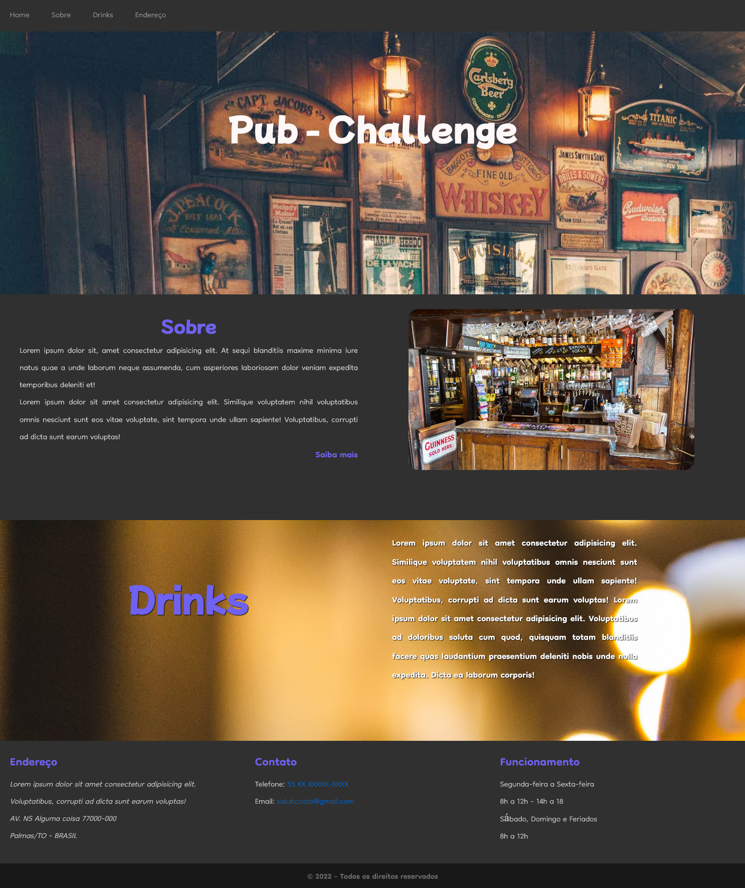

# Desafio criação de um Website de um PUB

Este desafio foi proposto pelo curso para criarmos uma página com os conhecimentos ofertados no curso de HTML5 e CSS3.

- Projeto:

- Como só possui html e css, não precisa de servidor local para executar.

- Bastar baixar e abrir o index.html
